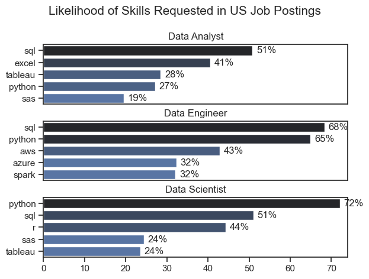
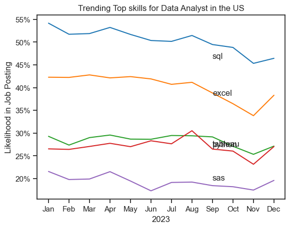

# Overview
Welcome to my analysis of the data job market, focusing on data analyst roles. This project was created out of a desire to navigate and understand the job market more efectively. It delves into the top-paying and in-demand skills to help find optimal job opportunities for data analysts.

The data sourced from Luke Barousse's Python Course which provides a foundation for my analysis, containing detailed information on job titles, salaries, location, and essential skills. Through a series of Python scripts, I explore key questions such as the most demanded skills, salary, salary trends, and the intersaction of demand and salary in data analytics.

# The Questions
Below are the questions I want to answer in my project:

1. What are the skills most in demand for the top 3 most popular data roles ?
2. How are in-demand skills trending for Data Analysis ?
3. How well do jobs and skills pay for Data Analysis ?
4. What are the optimal skills for data analyst tom learn? (High Demand AND High Paying)

# Tools I Used

For my deep dive into the data analyst job market, I harnessed the power of several key tools:
- Python: The backbone of my analysis, allowing me to analyze the data and find critical insights. I also used the following Python libraries:
    - Pandas Library: I used to analyze the data.
    - Matplotlib Library: I used to visualize the data.
    - Seaborn Library: Helped to create advanced visuals.

- Jupyter Notebooks: The tool I used to run my Python scripts which let me easily include my notes and analysis.
- Visual Studio Code: My go-to for executing my Python scripts.
- Git and Github: Essential for version control and sharing my Python code and analysis, ensuring collaboration with others.


# Data Preparation an clean up
This section outlines the steps taken to prepare the data for analysis, ensurinf accuracy and usability.

## Import and Clean up Data
I start by importing necessary libraries and loading the dataset, followed by initial data cleaning tasks .


# The Analysis

## What are the most demanded skills for the top 3 most popular data roles ?

To find the most demanded skills for the top 3 most popular data roles. I filtered out those positions by which ones were the most popular, and got the top 5 skills for these top 3 roles. This query highlights the most popular job titles and their top skills, showing which skills I should pay attention to depending on the role I'm targeting.

View my notebook with detailed steps here:
[2_Skills_Count.ipynb](3_Project/2_Skills_Count.ipynb)


### Visualize Data

```python
fig,ax = plt.subplots(len(job_titles),1)

for i,job_title in enumerate(job_titles):
    df_plot=df_skills_perc[df_skills_perc
    ['job_title_short']==job_title].head(5)[::-1]
    sns.barplot(data=df_plot,x='skill_percent',y='job_skills',ax=ax[i],hue='skill_count',
    palette='dark:b_r')
plt.show()
```
### Result



### Insights
* Python is a versatile skill, highly demanded across all three roles, but most prominently for Data Scientists (72%) and Data Engineers (65%).
* SQL is the most requested skills for Data Analysts and Data Scientists, with it in over half the job posting for both roles. For Data Engineers, Python is the most sought-after skill, appearing in 68% of job postings.
* Data Engineers require more specialized technical skills (AWS, Azure, Spark) compared to Data Analyst and Data Scientist who are expected to be proficient in more general data management and analysis tools (Excel, Tableau).

## 2. How are in-demand skills trending for Data Analysis ?

### Visualize Data

```python
from matplotlib.ticker import PercentFormatter

df_plot = df_da_us_percent.iloc[: , :5]
sns.lineplot(data=df_plot, dashes=False,legend='full' , palette='tab10')

plt.gca().yaxis.set_major_formatter(PercentFormatter(decimals=0))

plt.show()
```
### Results


*Bar graph visualize the trending top skills for data analysis in the US in 2023.*

### Insights:
- SQL remains the most consistently demanded skill throughout the year, although it shows a gradual decrease in demand.
- Excel experienced a significant increase in demand starting around September, surpassing both Python and Tableau by the end of the year.
- Both Python and Tableau show relatively stable demand throughout the year with some fluctuations.

## 3. How well do jobs and skills pay for Data Analysts ?

### Salary Analysis for Data Nerds

### Visualize Data

```python
sns.boxplot(data=df_us_top6, x='salary_year_avg', y='job_title_short', order=job_order)

ticks_x = plt.FuncFormatter(lambda y,pos: f'${int(y/1000)}K')
plt.gca.xaxis.set_major_formatter(ticks_x)
plt.show()
```

#### Results
[Salary Distributions of Data Jobs in the US](3_Project/images/Top_6_Data_Roles_Median_Salary.png)

*Box plot visualizing the salary distributions for top 6 data job titles.*

### Insights
- There is significant variations of salaries across different job titles. Senior Data Scientist positions tend to have the highest salary potential, with up to $600 K, indicating the high experience in the industry.

- Senior Data Engineer and Senior Data Scientist roles show a considerable number of outliers on the higher end of the salary spectrum, suggesting thta exceptional skills or circumstances can lead to high pay in these roles. In contrast, Data Analyst roles demonstrate more consistency in salary, with fewer outliers.

- The median salaries increase with the seniority and specialization of the roles. Senior roles (Senior Data Scientist, Senior Data Engineer) not only have higher median salaries but also larger differences in typical salaries, reflecting greater variance in compensation as responsibilities increase.

## 4. What is most optimal skills to learn for Data Analyst ?

#### Visualize Data

```python
from adjustText import adjust_text
df_plot = df_da_skills_high_demand.merge(df_technology, left_on ='job_skills',right_on='skills')

sns.plot(
    data=df_plot,
    x='skill_percent',
    y='median_salary',
    hue='technology'
)
sns.despine()
texts= []

for i, txt enumerate(df_da_skills_high_demand.index):
    texts.append(plt.text(df_da_skills_high_demand['skill_percent'].iloc[i],df_da_skills_high_demand['median_salary'].iloc[i], txt) )

# Adjust text to avoid overlap
adjust_text(texts, arrowprops=dict(arrowstyle='->', color='gray'))

# Set axis of plot
ax= plt.gca()
ax.xaxis.set_major_formatter(PercentFormatter(decimal=0))
ax.yaxis.set_major_formatter(plt.FuncFormatter(lambda x: f'${int(x/1000)}K'))

plt.show()

```
### Result
['Most Optimal Skills to learn for Data Analyst'](3_Project/images/Most_Optimal_Skills_To_Learn.png)
*A Scatter Plot visualizing the most optimal skills (high paying and high demand) for data analysts in the US.*

#### Insights:
- The scatter plot shows that most of the `programming` skills (colored blue) tend to cluster at higher salary levels compared to other categories, indicating that programming expertise might offer greater salary benifits within the data analytics field.

- Analyst tools (colored gree), including Tableau and Power BI, are prevalent, in job posting and offer competitive salaries, showing that visualization and data analysis software are crucial for current data roles. the category not only has good salaries but is also versatile across different types of data tasks.

- The database skills (colored orange), such as Oracle and SQL server, are associated with some of the Highest salaries among data analyst tools. This indicates a significant demand and valuation for data management and manipulation expertise in the industry.


# What I learned

Throughout this project, I deepened my understanding of the data analyst job market and enhanced my technical skills in Python, especially in data manipulation and visualization. Here are a few specific things I learned :

- Advanced Python Usage: Utilizing libraries suxh as Pandas for data manipulation, Seaborn and Matplotlib for data visualization, and other libraries helped me perform complex data analysis tasks more efficiently.

- Data Cleaning Importance: I learned that through data cleaning and preparation are crucial before any analysis can be conducted, ensuring the accuracy of insights derived from the data.

- Strategic Skill Analysis: The project emphasized the importance of alligning one's skills with market demand. Understanding the relationship between skill demand, salary ,and job availability allows for more strategic career planning in the tech industry.

## Insights
This project provided several general insights into the data job market for analysis:
* Skill Demand and Salary Correlation: There is a clear correlation between demand for specific skills and the salaries these skills command. Advanced and specialized skills like Python and oracle often lead to higher salaries.
* Market Trends: There are charging trends in skill demand, highlighting the dynamic nature of the data job market, Keeping up with these trends is essential for career growth in data analytics.
* Economic Value of Skills: Understanding which skills are both in-demand and well-compensated can guide data analysts in priortizing learning to maximize their economic returns.

## Challenge I Faced
This project was not without its challenges, but it provided good learning opportunities:

 - Data Inconsistencies: Handling missing or inconsistent data entries requires careful consideration 

 - Complex Data Visualization: Designing effective visual representations of complex datasets was challenging

 - Balancing Breadth and Depth: Deciding how deeply to dive into each analysis while maintaining a broad overview.

 ## Conclusion
 This exploration into the data analyst job market has been incredible informative, highlighting the critical skills and trends that shape this evolving field. the insights I got enhance my understanding and provide actionable guidance for anyone looking to advance their career in data analytics. As the market continues to change, ongoing analysis to stay ahead in data analytics. this project is a good foundation for future and underscores the importance of continuous learning and adaption in the data field.


